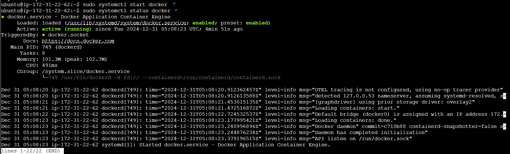
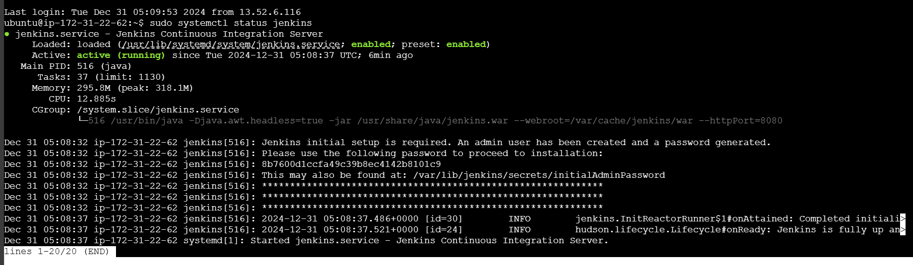
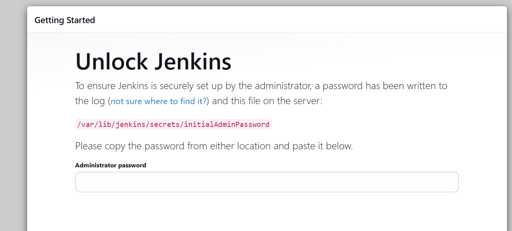
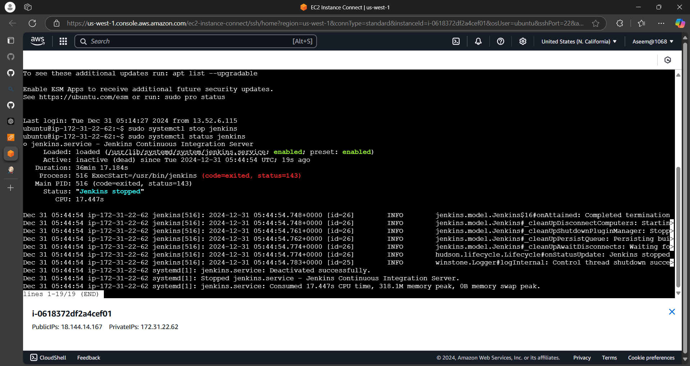
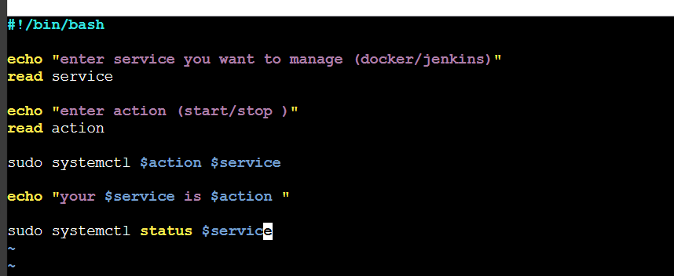
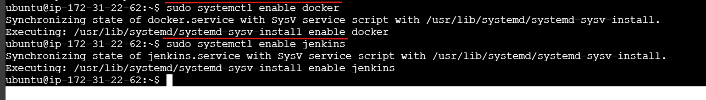
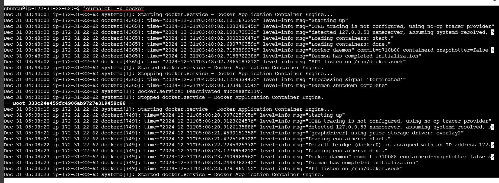
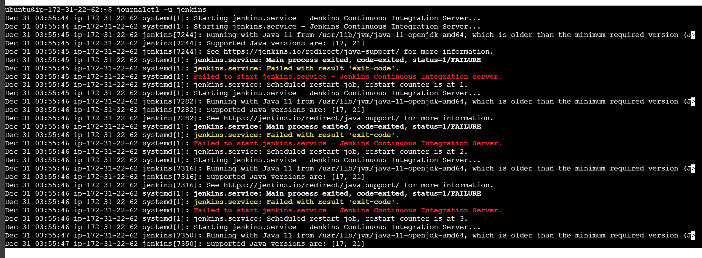
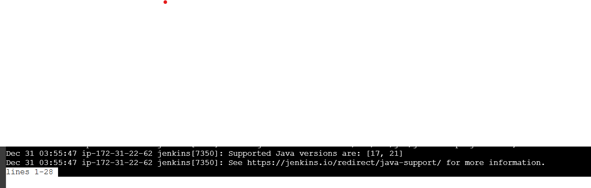

# Day 7 Answers: Understanding Package Manager and Systemctl

## Tasks

1. **Install Docker and Jenkins:**
   - Install Docker and Jenkins on your system from your terminal using package managers.

   **Answer**
     - **First-Installing Docker**
       - Update the package list and install required packages:
         ```bash
            sudo apt update
            sudo apt install apt-transport-https ca-certificates curl software-properties-common 
       - Add Docker’s official GPG key:
         ```bash
            curl -fsSL https://download.docker.com/linux/ubuntu/gpg | sudo apt-key add -          
       - Add the Docker APT repository:
         ```bash
            sudo add-apt-repository "deb [arch=amd64] https://download.docker.com/linux/ubuntu $(lsb_release -cs) stable"
       - Update the package list again:
         ```bash
            sudo apt update
       - Install Docker:
         ```bash
            sudo apt install docker-ce
       - Check Docker installation:
         ```bash
            sudo systemctl status docker

     - **Installing Jenkins**
       - Add the Jenkins repository key to the system:
         ```bash
            curl -fsSL https://pkg.jenkins.io/debian/jenkins.io.key | sudo apt-key add -
       - Add the Jenkins repository:
         ```bash
            sudo sh -c 'echo deb http://pkg.jenkins.io/debian-stable binary/ > /etc/apt/sources.list.d/jenkins.list'
       - Update the package list:
         ```bash
            sudo apt update
       - Install Jenkins:
         ```bash
            sudo apt install jenkins
       - Start Jenkins:
         ```bash
            sudo systemctl start jenkins
       - Note:
         - First, check whether JAVA is installed or not.
           ```bash
              java -version
         - If you have not installed
           ```bash
              sudo apt install default-jre

   Output
   
   

   Output (Jenkins-UI)
   

3. **Write a Blog or Article:**
   - Write a small blog or article on how to install these tools using package managers on Ubuntu and CentOS.

   **Answer**
    above

### Systemctl and Systemd

Systemctl is used to examine and control the state of the “systemd” system and service manager. Systemd is a system and service manager for Unix-like operating systems (most distributions, but not all).

## Tasks

1. **Check Docker Service Status:**
   - Check the status of the Docker service on your system (ensure you have completed the installation tasks above).

   **Answer**
   

2. **Manage Jenkins Service:**
   - Stop the Jenkins service and post before and after screenshots.

   **Answer**
   

3. **Read About Systemctl vs. Service:**
   - Read about the differences between the `systemctl` and `service` commands.
   - Example: `systemctl status docker` vs. `service docker status`.

   **Answer**
    - Understanding the `systemctl` and `service` Commands
      - Both `systemctl` and `service` commands are used to manage system services in Linux, but they differ in terms of usage, functionality, and the system architectures they support.
      - **`systemctl` Command**
        - `systemctl` is a command used to introspect and control the state of the `systemd` system and service manager. It is more modern and is used in systems that use `systemd` as their init system, which is common in many contemporary Linux distributions.
        - Examples:
          - Check the status of the Docker service:
            ```bash
               sudo systemctl status docker    
          - Start the Jenkins service:
            ```bash
               sudo systemctl start jenkins 
          - Stop the Docker service:
            ```bash
               sudo systemctl stop docker
          - Enable the Jenkins service to start at boot:
            ```bash
               sudo systemctl enable jenkins
             
      - **`service` Command**
        - 'service' is a command that works with the older 'init' systems (like SysVinit). It provides a way to start, stop, and check the status of services. While it is still available on systems using 'systemd' for backward compatibility, its usage is generally discouraged in favor of 'systemctl'.
        - Examples:
          - Check the status of the Docker service:
            ```bash
               sudo service docker status    
          - Start the Jenkins service:
            ```bash
               sudo service jenkins start
          - Stop the Docker service:
            ```bash
               sudo service docker stop

      - **Key Differences**
        - 1 System Architecture:
          - `systemctl` works with `systemd`.
          - `service` works with SysVinit and is compatible with `systemd` for backward compatibility.    
        - 2 Functionality:
          - `systemctl` offers more functionality and control over services, including management of the service's state (start, stop, restart, reload), enabling/disabling services at boot, and querying detailed service status.
          - `service` provides basic functionality for managing services, such as starting, stopping, and checking the status of services.
        - 3 Syntax and Usage:
          - `systemctl` uses a more unified syntax for managing services.
          - `service` has a simpler and more traditional syntax.

### Additional Tasks

4. **Automate Service Management:**
   - Write a script to automate the starting and stopping of Docker and Jenkins services.

   **Answer**
   - SCRIPT
   
   

6. **Enable and Disable Services:**
   - Use systemctl to enable Docker to start on boot and disable Jenkins from starting on boot.

   **Answer**
    - Enable Docker to start on boot:
       
    - Disable Jenkins from starting on boot:
    

7. **Analyze Logs:**
   - Use journalctl to analyze the logs of the Docker and Jenkins services. Post your findings.

   **Answer**
    - Docker Logs:
   

    - Jenkins Logs:
   


**if you shaw it**
 
 - then enter 
     ``` q
