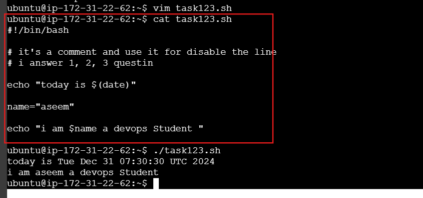
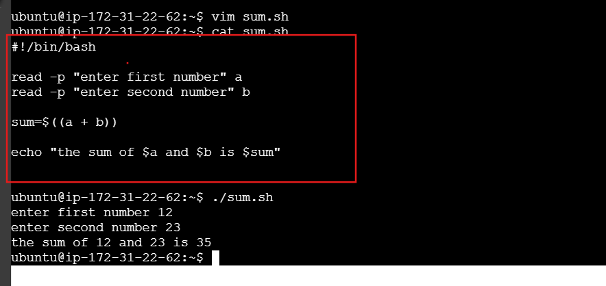
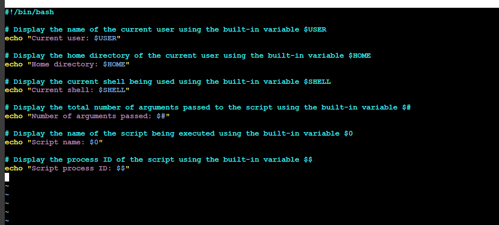
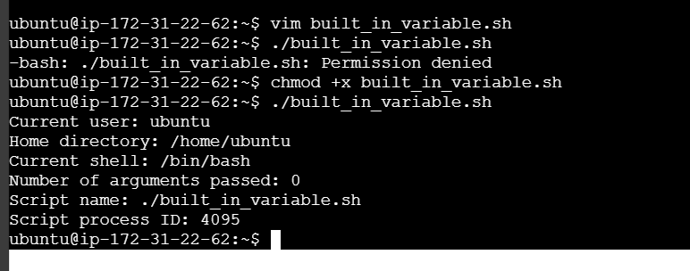
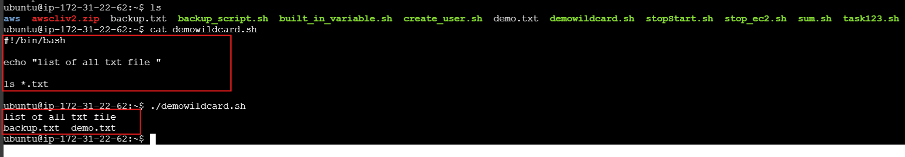

# Day 8 Answers: Shell Scripting Challenge

## Tasks

1. **Comments**
   - In bash scripts, comments are used to add explanatory notes or disable certain lines of code. Your task is to create a bash script with comments explaining what the script does.

    
2. **Echo**
   - The echo command is used to display messages on the terminal. Your task is to create a bash script that uses echo to print a message of your choice.

    

3. **Variables**
   - Variables in bash are used to store data and can be referenced by their name. Your task is to create a bash script that declares variables and assigns values to them.

   **Answer123**

   

4. **Using Variables**
   - Now that you have declared variables, let's use them to perform a simple task. Create a bash script that takes two variables (numbers) as input and prints their sum using those variables.

   **Answer**

     

5. **Using Built-in Variables**
   - Bash provides several built-in variables that hold useful information. Your task is to create a bash script that utilizes at least three different built-in variables to display relevant information.
     
  **Answer**

   
   - output.
     
   
           

7. **Wildcards**
   - Wildcards are special characters used to perform pattern matching when working with files. Your task is to create a bash script that utilizes wildcards to list all the files with a specific extension in a directory.

   **Answer**

        
   
