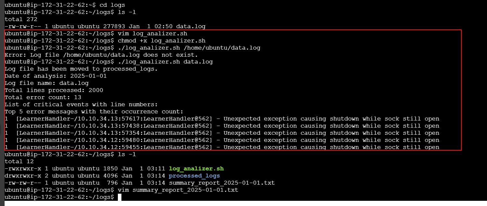

---

# Day 10 Answers: Log Analyzer and Report Generator

## Scenario

You are a system administrator responsible for managing a network of servers. Every day, a log file is generated on each server containing important system events and error messages. As part of your daily tasks, you need to analyze these log files, identify specific events, and generate a summary report.

## Task

Write a Bash script that automates the process of analyzing log files and generating a daily summary report. The script should perform the following steps:

1. **Input:** The script should take the path to the log file as a command-line argument.
2. **Error Count:** Analyze the log file and count the number of error messages. An error message can be identified by a specific keyword (e.g., "ERROR" or "Failed"). Print the total error count.
3. **Critical Events:** Search for lines containing the keyword "CRITICAL" and print those lines along with the line number.
4. **Top Error Messages:** Identify the top 5 most common error messages and display them along with their occurrence count.
5. **Summary Report:** Generate a summary report in a separate text file. The report should include:
   - Date of analysis
   - Log file name
   - Total lines processed
   - Total error count
   - Top 5 error messages with their occurrence count
   - List of critical events with line numbers

---

## Solution

### Bash Script

```bash
#!/bin/bash

# Function to display usage
usage() {
    echo "Usage: $0 /path/to/logfile.log"
    exit 1
}

# Check if the log file path is provided
if [ $# -ne 1 ]; then
    usage
fi

LOG_FILE=$1

# Check if the log file exists
if [ ! -f "$LOG_FILE" ]; then
    echo "Error: Log file $LOG_FILE does not exist."
    exit 1
fi

# Variables
ERROR_KEYWORD="ERROR"
CRITICAL_KEYWORD="CRITICAL"
DATE=$(date +"%Y-%m-%d")
SUMMARY_REPORT="summary_report_$DATE.txt"
ARCHIVE_DIR="processed_logs"

# Create a summary report
{
    echo "Date of analysis: $DATE"
    echo "Log file name: $LOG_FILE"
} > "$SUMMARY_REPORT"

# Total lines processed
TOTAL_LINES=$(wc -l < "$LOG_FILE")
echo "Total lines processed: $TOTAL_LINES" >> "$SUMMARY_REPORT"

# Count the number of error messages
ERROR_COUNT=$(grep -c "$ERROR_KEYWORD" "$LOG_FILE")
echo "Total error count: $ERROR_COUNT" >> "$SUMMARY_REPORT"

# List of critical events with line numbers
echo "List of critical events with line numbers:" >> "$SUMMARY_REPORT"
grep -n "$CRITICAL_KEYWORD" "$LOG_FILE" >> "$SUMMARY_REPORT"

# Identify the top 5 most common error messages
declare -A error_messages
while IFS= read -r line; do
    if [[ "$line" == *"$ERROR_KEYWORD"* ]]; then
        message=$(echo "$line" | awk -F"$ERROR_KEYWORD" '{print $2}')
        (( error_messages["$message"]++ ))
    fi
done < "$LOG_FILE"

# Sort and display top 5 error messages
echo "Top 5 error messages with their occurrence count:" >> "$SUMMARY_REPORT"
for message in "${!error_messages[@]}"; do
    echo "${error_messages[$message]} $message"
done | sort -rn | head -n 5 >> "$SUMMARY_REPORT"

# Optional: Archive or move processed log files
if [ ! -d "$ARCHIVE_DIR" ]; then
    mkdir -p "$ARCHIVE_DIR"
fi
mv "$LOG_FILE" "$ARCHIVE_DIR/"
echo "Log file has been moved to $ARCHIVE_DIR."

# Print the summary report
cat "$SUMMARY_REPORT"
```

---

## Output

- The script will analyze the log file and generate a report named `summary_report_YYYY-MM-DD.txt`, where `YYYY-MM-DD` is the current date.

Here is a sample output of the generated summary report:

 

---

## Optional Enhancement

- The script includes an optional feature to automatically archive or move the processed log files to a designated directory (`processed_logs`) after the analysis is complete.

---

## Tips

- Use `grep`, `awk`, and other command-line tools to process the log file.
- Utilize arrays or associative arrays to keep track of error messages and their counts.
- Add appropriate error handling to manage cases where the log file doesn’t exist or other issues arise.

---

## Sample Log File

A sample log file named `sample_log.log` can be found [here](https://github.com/logpai/loghub/blob/master/Zookeeper/Zookeeper_2k.log) for testing purposes.

---

