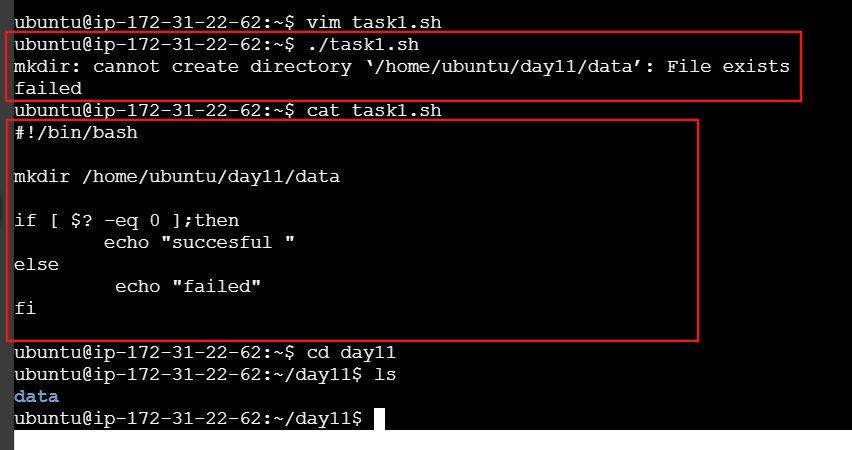
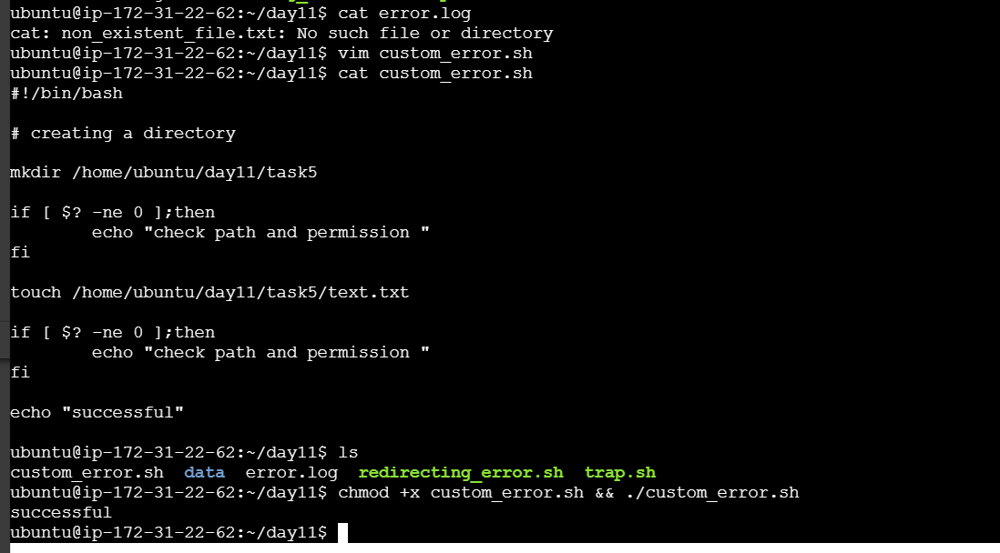

# Day 11 Answers: Error Handling in Shell Scripting

## Learning Objectives
Understanding how to handle errors in shell scripts is crucial for creating robust and reliable scripts. Today, you'll learn how to use various techniques to handle errors effectively in your bash scripts.

## Topics to Cover
1. **Understanding Exit Status**: Every command returns an exit status (0 for success and non-zero for failure). Learn how to check and use exit statuses.
2. **Using `if` Statements for Error Checking**: Learn how to use `if` statements to handle errors.
3. **Using `trap` for Cleanup**: Understand how to use the `trap` command to handle unexpected errors and perform cleanup.
4. **Redirecting Errors**: Learn how to redirect errors to a file or `/dev/null`.
5. **Creating Custom Error Messages**: Understand how to create meaningful error messages for debugging and user information.

## Tasks with Answers

### Task 1: Checking Exit Status
- Write a script that attempts to create a directory and checks if the command was successful. If not, print an error message.

**Answer1_2**

 

### Task 2: Using `if` Statements for Error Checking
- Modify the script from Task 1 to include more commands (e.g., creating a file inside the directory) and use `if` statements to handle errors at each step.

**Answer**

above

### Task 3: Using `trap` for Cleanup
- Write a script that creates a temporary file and sets a `trap` to delete the file if the script exits unexpectedly.

**Answer**

 
 
### Task 4: Redirecting Errors
- Write a script that tries to read a non-existent file and redirects the error message to a file called `error.log`.

**Answer**


### Task 5: Creating Custom Error Messages
- Modify one of the previous scripts to include custom error messages that provide more context about what went wrong.

**Answer** 


 
## Example Scripts

### Example 1: Checking Exit Status
```bash
#!/bin/bash
mkdir /tmp/mydir
if [ $? -ne 0 ]; then
  echo "Failed to create directory /tmp/mydir"
fi
```

### Example 2: Trap
```bash
#!/bin/bash
tempfile=$(mktemp)
trap "rm -f $tempfile" EXIT

echo "This is a temporary file." > $tempfile
cat $tempfile
# Simulate an error
exit 1
```

### Example 3: Redirecting Errors
```bash
#!/bin/bash
cat non_existent_file.txt 2> error.log
```

### Example 4: Custom Error Messages
```bash
#!/bin/bash
mkdir /tmp/mydir
if [ $? -ne 0 ]; then
  echo "Error: Directory /tmp/mydir could not be created. Check if you have the necessary permissions."
fi
```

 
